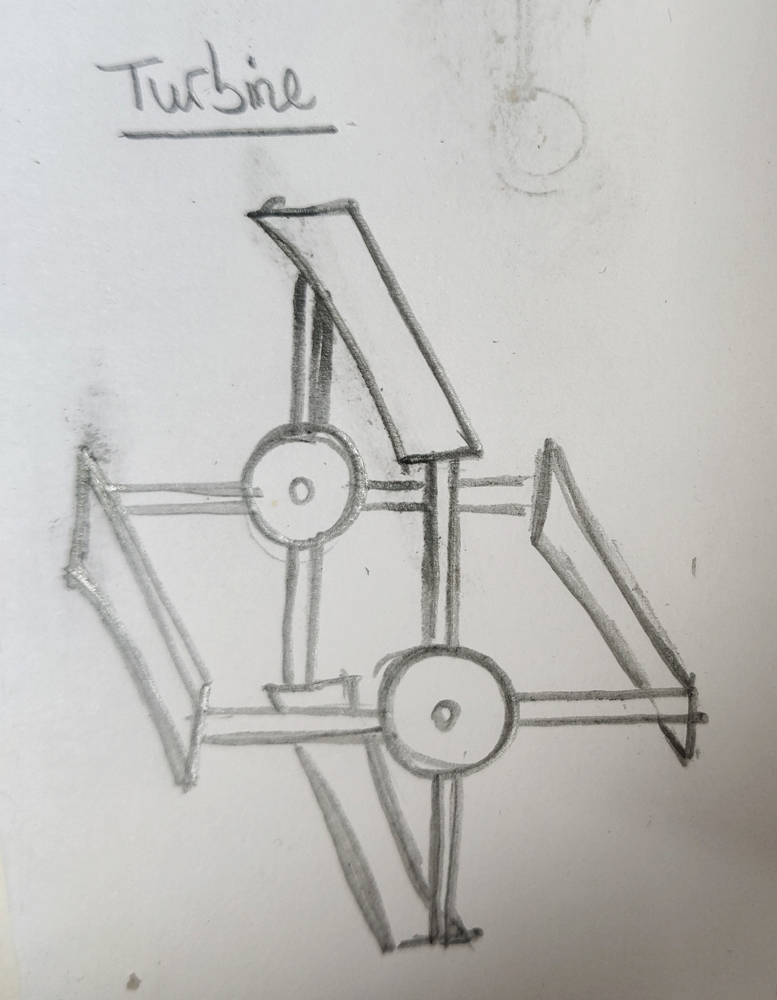
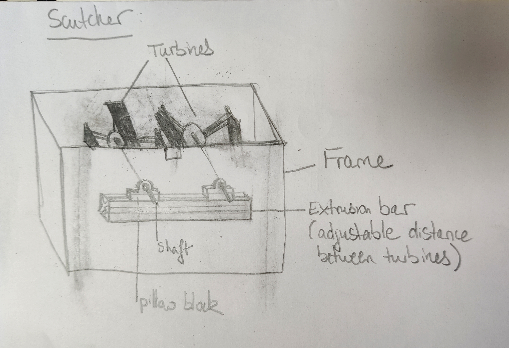
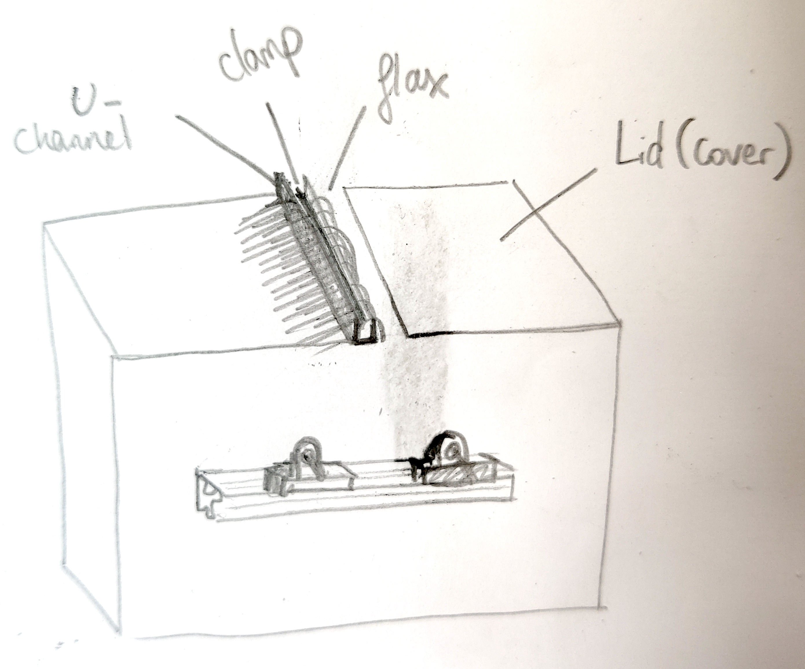

# flax-scutcher
Flax scutching machine

## Version 1

The flax scutching machine will have two interlocking turbines, each turbine blade will be approx 500mm long.

Rough sketch of a single turbine:

The turbines will be held in a plywood frame. The axles will be attached to pillow blocks fastened to a 60x60 extrusion bar (itself fastened to the plywood). This will allow the distance between the turbines to be adjusted as we don't yet know what the ideal separation is.

The flax will be held by a clamp and guided by a U-channel that passes between the two turbines (the flax then falls through an opening in the lid and is caught by the rotating turbine blades):

