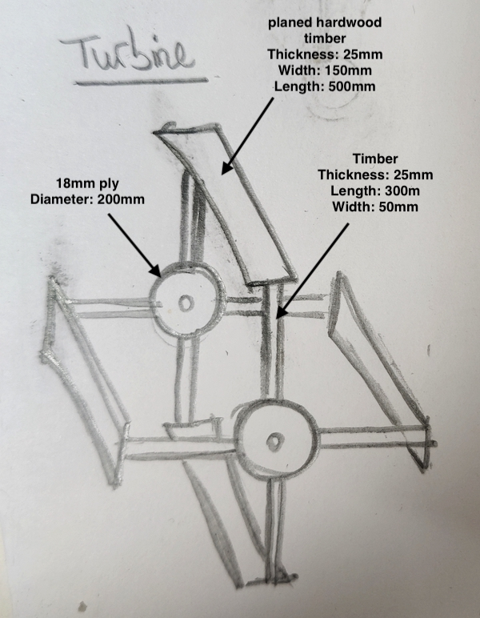
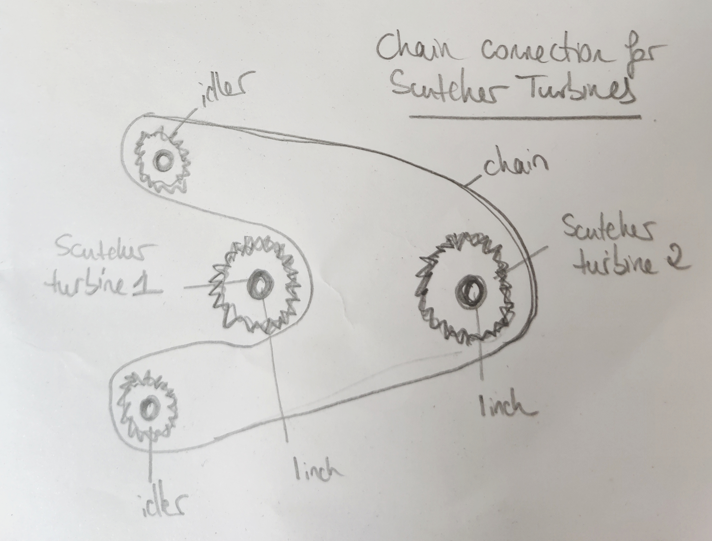

# flax-scutcher
Flax scutching machine

## Version 1

The flax scutching machine will have two interlocking turbines, each turbine blade will be approx 500mm long.

Rough sketch of a single turbine:

  

The turbines will be held in a plywood frame. The axles will be attached to pillow blocks fastened to a 60x60 extrusion bar (itself fastened to the plywood). This will allow the distance between the turbines to be adjusted as we don't yet know what the ideal separation is.

The flax will be held by a clamp and guided by a U-channel that passes between the two turbines (the flax then falls through an opening in the lid and is caught by the rotating turbine blades):

One of the turbines will be driven from the motor on one side. On the other side the two turbines are linked in such a way that they are driven in opposite directions. Here is a sketch of this transmission arrangement:

### Parts List (UK)

**Motor** 
- Motor (1500W ebike rear hub conversion kit with freehweel) ([Amazon](https://www.amazon.co.uk/dp/B0F4MY23LT?ref=ppx_yo2ov_dt_b_fed_asin_title))
- 48V 1500W power supply
- Emergency stop button ([Amazon](https://www.amazon.co.uk/gp/product/B07LFXB8PF/ref=ox_sc_act_title_2?smid=A1ZJKGYC1NCLC9&psc=1))
- 2 x Waterproof boxes for the electrics ([Amazon](https://www.amazon.co.uk/gp/product/B0FRNKJMFR/ref=ox_sc_act_title_4?smid=A1Y7ZINZ9CKS92&psc=1))
- 12 awg electric wire (black and red) ([Amazon](https://www.amazon.co.uk/Gruiqrd-Silicone-Electrical-Flexible-Temperature/dp/B0CZRGKBHH/ref=sr_1_4_pp?crid=25BK3QEE42MWJ&dib=eyJ2IjoiMSJ9.B2HSOxa6wjgNRyjCSxDWdoEojGJs7M-u2pxIdw0zZ5VyYOwBOX4NQ8GnO-QPcscD9n1_Bjjg_Ob9rWruZRc2qmEbo7wluuwWgKN4asrGeMnE2z12eDVQXcrkpO6b9GftNXrpcnyFivKQV3T9rQk5iDqfvOL1Rpe_DtT1sn4zOlW3VSHZNf9MC7cy4W2PbQrbyAiqCbabp0X2D3tQLXud4RnRAY8uNYylwzZqXd8NkaFjzP3PHlfDKrZyy0qGdoSTd-Y7hhrCHBSq54x5HVeg59Ftcd3Fy0ojDSqQZotaqds.dd_p8SBI8HkgYp7qWSc9dTVA4T04HpJkGG7UK1fhkAg&dib_tag=se&keywords=12%2Bawg%2Bwire&qid=1777391425&s=industrial&sprefix=12%2Bawg%2Bwi%2Cindustrial%2C415&sr=1-4&th=1))
- 2 x 35amp fuse ([Amazon](https://www.amazon.co.uk/gp/product/B0FV1PPHHS/ref=ox_sc_act_title_2?smid=A2U3HUDR85B7H0&psc=1))
- electric plug
- 3 core electric wire (16awg)
- 10K potentiometer ([Amazon](https://www.amazon.co.uk/gp/product/B095X7JQP9/ref=sw_img_1?smid=A2L9T8IGQDPJ43&th=1))

**Transmission**

For the motor:

- 20 teeth 08B1 Roller Chain Sprocket ([Bearing Boys](https://www.bearingboys.co.uk/08B1-12inch-Simplex-Sprockets/4120-Roller-Chain-Sprocket-6155-p))
- 1610 taperlock bush, 40mm bore size ([Bearing Boys](https://www.bearingboys.co.uk/1610-Taper-Bushes/161040-Taper-Bush-Dunlop-2316-p))
- 95 teeth 08B1 Roller Chain Sprocket ([Bearing Boys](https://www.bearingboys.co.uk/08B1-12inch-Simplex-Sprockets/4195-Roller-Chain-Sprocket-6213-p))
- 2012 taperlock bush, 1inch bore ([Bearing Boys](https://www.bearingboys.co.uk/2012-Taper-Bushes/20121-Taper-Bush-Dunlop-2373-p))
- 1008 taper bush 1 inch bore ([Bearing Boys](https://www.bearingboys.co.uk/1008-Taper-Bushes/10081-Dunlop-Taper-Bush-with-1inch-Bore-2216-p))
- 2 x 2 bolt flanged bearing, 1 inch bore ([Bearing Boys](https://www.bearingboys.co.uk/2-Bolt-Flanged-Bearings/UCFL20516-Dunlop-2-Bolt-Oval-Flange-Bearing-with-1inch-Bearing-Insert--10919-p))
- 200mm 1 inch mild steel tube

For the turbines:

- 18mm ply
- Turbine frame timber ([Travis Perkins](https://www.travisperkins.co.uk/treated-timber/25mm-x-50mm-x-3-6m-sawn-softwood-carcassing-treated-green/p/206941))
- Blade hardwood ([Travis Perkins](https://www.travisperkins.co.uk/planed-hardwood-timber/25mm-x-150mm-hardwood-planed-timber-all-round-red-grandis/p/608003))

- 2 x 30 teeth 08B1 Roller Chain Simplex Sprocket ([Bearing Boys](https://www.bearingboys.co.uk/08B1-12inch-Simplex-Sprockets/4130-Roller-Chain-Sprocket-6195-p))
- 2 x 2012 taperlock bush, 1 inch bore ([Bearing Boys](https://www.bearingboys.co.uk/2012-Taper-Bushes/20121-Taper-Bush-Dunlop-2373-p))
- 2 x 20 teeth 08B1 Roller Chain Simplex Sprocket ([Bearing Boys](https://www.bearingboys.co.uk/08B1-12inch-Simplex-Sprockets/4120-Roller-Chain-Sprocket-6155-p))
- 2 x 1610 taperlock bush, 1 inch bore ([Bearing Boys](https://www.bearingboys.co.uk/product.cgi?id=2322&action=addtobasket&qty=1))
- 5m 08B1 chain
- 3 x simplex connecting links
- 4 x bolt on hub ([Bearing boys](https://www.bearingboys.co.uk/Bolt-On-Hubs/BF16-Bolt-on-Hub--Taper-Bush-91121-p))
- 4 x 1610 taper bush ([Bearing boys](https://www.bearingboys.co.uk/1610-Taper-Bushes/16101-Taper-Bush-Dunlop-2322-p))
- 2 x 1m 1inch mild steel tube (3mm wall)
- 2 x 200mm mild steel tube (3mm wall)
- 4 x pillow block bearing, 1 inch bore ([Bearing Boys](https://www.bearingboys.co.uk/UCPUCPX-Pillow-Blocks/UCP20516-Dunlop-1inch-Pillow-Block-Bearing-10790-p))
- 4 x 2 bolt flanged bearing, 1 inch bore ([Bearing Boys](https://www.bearingboys.co.uk/2-Bolt-Flanged-Bearings/UCFL20516-Dunlop-2-Bolt-Oval-Flange-Bearing-with-1inch-Bearing-Insert--10919-p)) 
- 4 x 350mm 30x30 (or 40x40) aluminium extrusion bars (with m6 t-nuts and bolts)

Hardware:
- 24 x m8 threaded insert for wood 13mm length ([Accu](https://www.accu.co.uk/threaded-inserts-for-wood/649066-HCSTIF-M8-13-14-5-BZP))
- 24 x m8 joint connector bolts ([Accu](https://www.accu.co.uk/search?Length+%28L%29=50+mm&Thread+Size=M8&cs_ids=2272&query=m8+bolt))